# Proposed Herdr Subagent Architecture

> **Status: proposed.** This document describes the agreed post-refactor design. It is not a description of the current implementation. See [`subagents_structure.md`](./subagents_structure.md) for the current architecture and [`../../PLAN.md`](../../PLAN.md) for the implementation plan.

## Purpose

The refactor makes subagent delegation easier to understand and modify by removing speculative runtime abstraction, duplicate single/parallel orchestration, wave scheduling, correlation IDs, and leaked cleanup details.

The design uses fewer, deeper modules:

- the tool module owns Pi-facing policy and presentation;
- one concrete Herdr delegation module owns execution;
- one Herdr session module owns a visible child session's lifecycle;
- the only runtime port is the real JSON-RPC process seam.

## Domain model

| Term | Meaning |
|---|---|
| **Subagent delegation** | One parent tool call containing one or more delegated tasks. |
| **Delegated task** | One turn assigned to a visible subagent. |
| **Delegated task number** | The one-based, delegation-scoped identity assigned once to a requested task. |
| **Visible subagent session** | The persistent child Pi session in a Herdr pane. It may outlive the delegated task. |
| **Delegated task outcome** | The single terminal result associated with a delegated task. |
| **Callable agent catalog** | The session-scoped snapshot of user/workspace agents and trusted project overrides. |

A delegated task and a visible subagent session are deliberately different lifetimes:

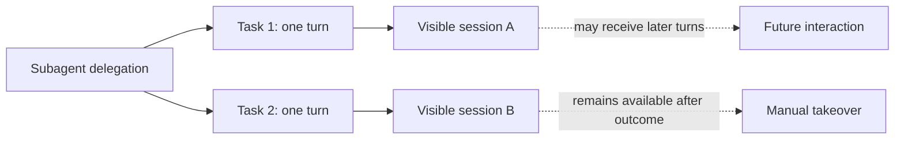

## Proposed package structure

```text
packages/herdr-subagent/
├── index.ts                 # Pi lifecycle adapter and composition root
├── subagent-tool.ts         # Request policy, task resolution, presentation
├── agents.ts                # Session-scoped callable agent catalog
├── pi-session.ts            # Session metadata and exact answer-entry access
└── herdr/
    ├── delegation.ts        # Workspace placement and ordered execution
    ├── session.ts           # Child launch, observation, prompt ownership
    └── rpc.ts               # Unix-socket NDJSON transport
```

The `herdr/` directory groups one concrete runtime implementation. It is not a generic backend layer.

## Module dependency diagram

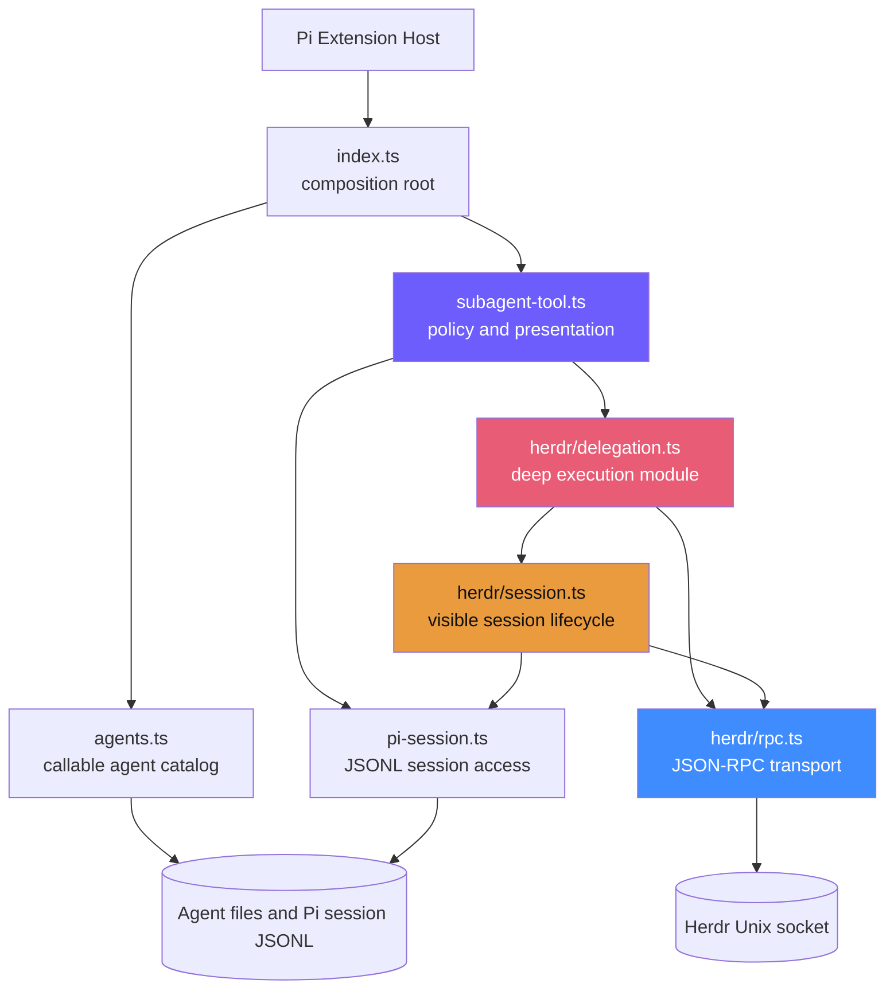

### Dependency rule

`subagent-tool.ts` imports only the deep `executeHerdrDelegation` operation from the Herdr implementation. It does not know about panes, RPC methods, launch retries, prompt files, polling, or workspace locking.

No `SubagentBackend`, `BackendSelection`, `SpawnBatchResult`, or backend auto-detection interface remains.

## Module responsibilities

| Module | Owns | Does not own |
|---|---|---|
| `index.ts` | Pi lifecycle, project trust, session catalog snapshot, tool registration, dependency composition | Validation, execution, Herdr protocol |
| `subagent-tool.ts` | Strict tool schema, semantic task validation, agent resolution, task numbering, mixed valid/invalid merging, progress semantics, final content/details | Herdr RPC, pane placement, prompt files, polling |
| `agents.ts` | Agent file discovery, frontmatter parsing, nearest project catalog, precedence, sorted immutable catalog | Per-task rediscovery, Herdr execution |
| `pi-session.ts` | Pi header parsing, exact terminal assistant entry selection, answer-entry resolution | Polling Herdr, rendering tool output |
| `herdr/delegation.ts` | Herdr environment validation, workspace tab lock/provisioning, pane placement, sequential launch, ordered outcome accounting | Model-facing formatting, agent discovery |
| `herdr/session.ts` | One child launch, argv, labels, retries, launch certainty, prompt lease, Pi-hook-backed turn observation, session metadata capture | Multi-task ordering, tool presentation |
| `herdr/rpc.ts` | Request IDs, NDJSON framing, socket lifecycle, timeout, abort, JSON-RPC response errors | Domain classification, retries, pane policy |

## Main interfaces

The types below are illustrative. Exact TypeScript placement may change while preserving these contracts.

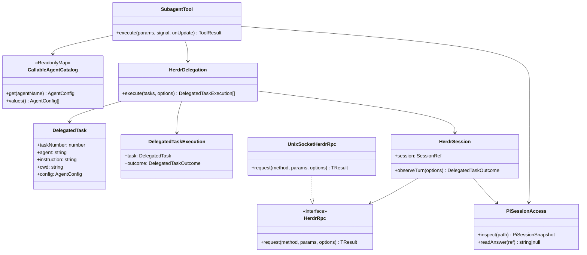

`HerdrRpc` is an earned port: production uses a Unix-socket adapter and tests use a scripted adapter. There is no runtime-neutral subagent port above it.

## Session-scoped catalog lifecycle

Agent discovery happens once per Pi session lifecycle, not once per task or tool call.

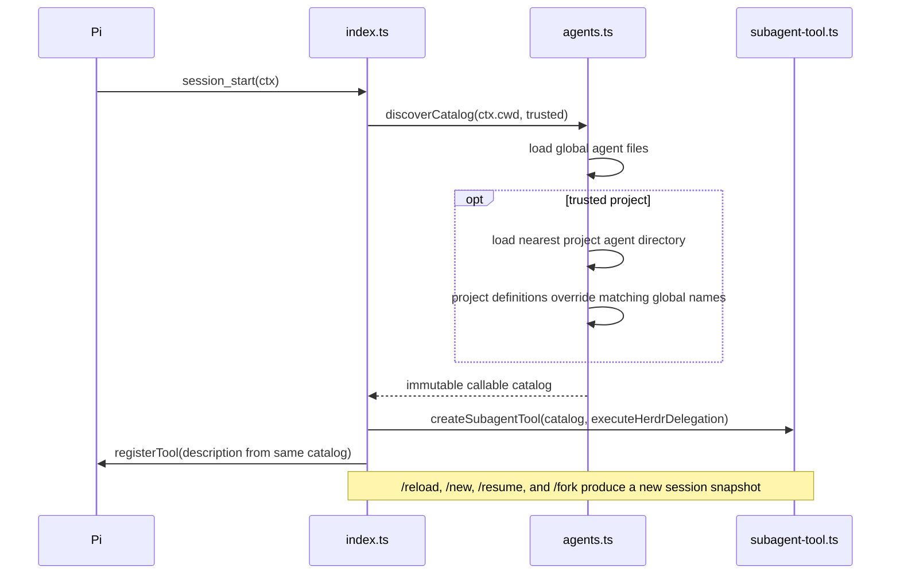

This guarantees that the tool description and runtime resolution agree. Agent file changes become visible through Pi's normal session/reload lifecycle.

## Tool execution flow

### Request validation and partial acceptance

Structurally malformed calls are rejected by the strict TypeBox schema. Well-shaped task entries are validated independently.

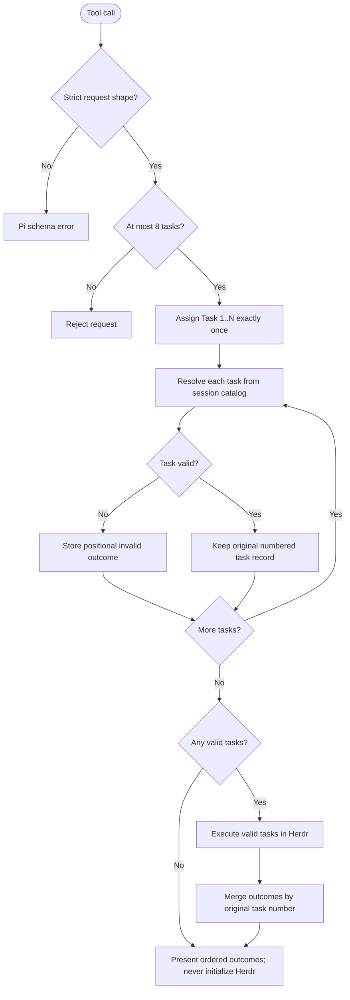

Invalid siblings do not block valid tasks. The one-based `taskNumber` is the only task correlation identity throughout the pipeline.

## Herdr delegation execution

### Sequential launch with immediate concurrent observation

There is no four-task wave scheduler. Up to eight valid tasks are launched sequentially. Observation starts immediately after each confirmed launch and overlaps later launches.

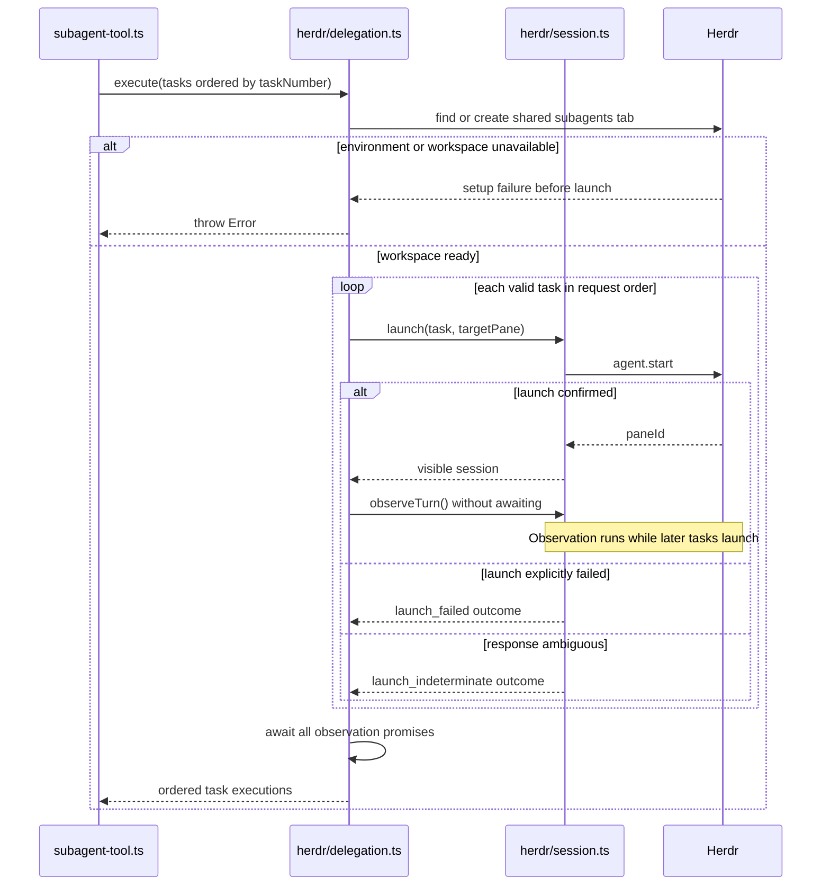

The process-wide workspace lock covers shared tab provisioning and sequential pane placement. It does not wait for child turns to settle.

### Positional accounting

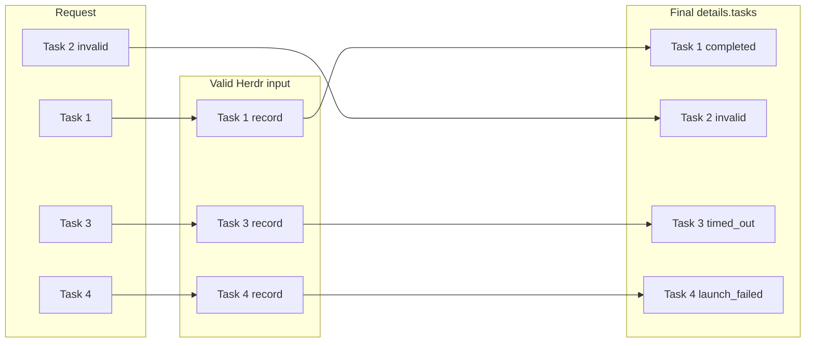

No invocation ID, duplicate numbering, backend correlation map, or runtime output parser is needed.

## Visible session lifecycle

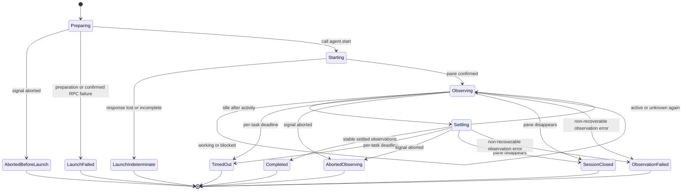

`Completed`, `TimedOut`, and `AbortedObserving` end the parent's observation of a delegated turn. They do not terminate the visible subagent session.

## Pi-hook-backed settlement observation

The parent does not infer completion from process exit. Herdr's managed Pi extension projects child Pi lifecycle hooks into Herdr state.

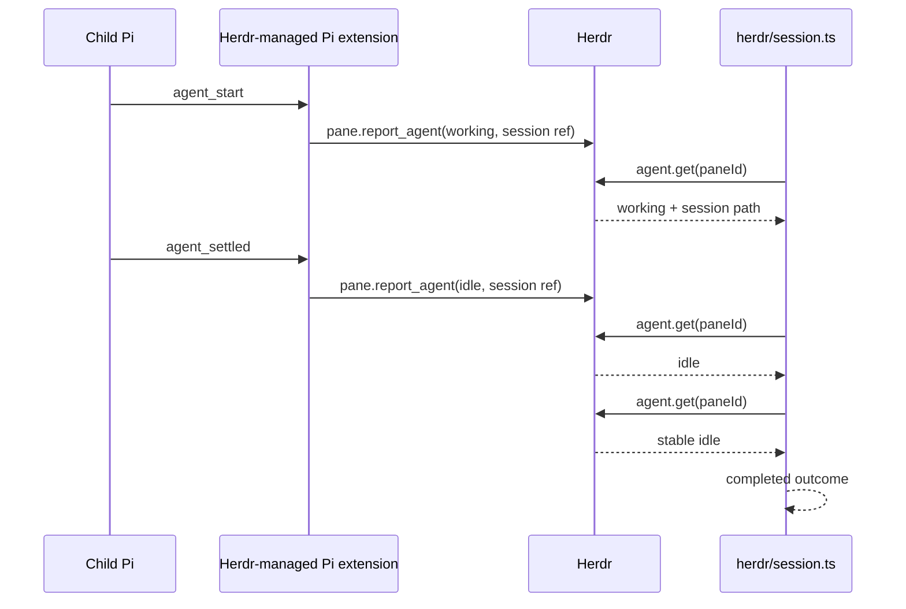

Pi hooks are process-local. Herdr supplies the existing cross-process projection; this refactor does not add another child hook bridge.

## Pi session metadata and answer references

The observer carries references, not potentially large answer strings.

### Session reference

```ts
interface SessionRef {
  paneId: string;
  label: string;
  pi?: {
    id: string;
    path: string;
    cwd: string;
  };
}
```

- `paneId` and `label` identify the live Herdr session.
- `pi.path` is the preferred exact same-machine resume reference.
- `pi.id` and `pi.cwd` preserve Pi-native lookup context.
- `pi` is absent if the session header was not available before the outcome.

### Exact answer reference

```ts
interface SessionAnswerRef {
  path: string;
  entryId: string;
}
```

Pi session message entries already have stable IDs. An entry ID is safer than a byte offset or “latest answer” lookup because later turns can append to the same persistent session.

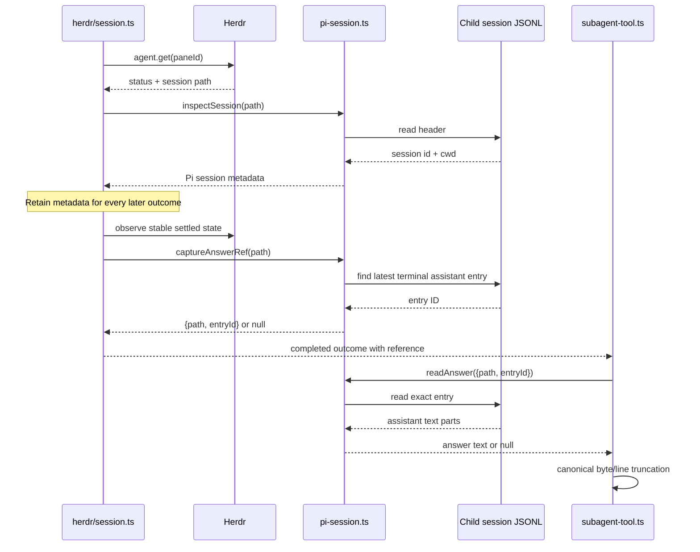

The answer is extracted only while building final model-facing content. Structured details retain the reference, not a duplicate answer.

## Prompt-file lease lifecycle

A child agent's system prompt is written to a temporary file and passed through `--append-system-prompt`. The file is local launch infrastructure, not part of the delegated task outcome.

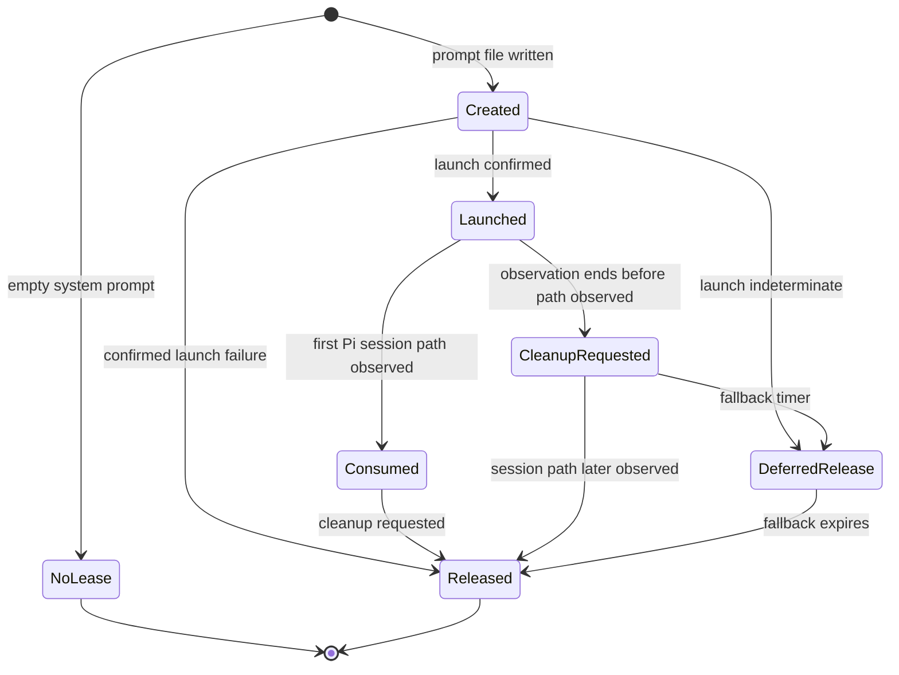

Release is idempotent, non-throwing, and best-effort. It deletes only the temporary prompt directory; it never closes the pane or child Pi session.

## Outcome model

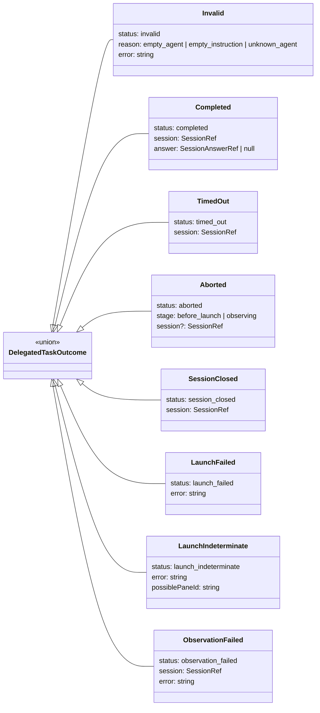

The TypeScript union keeps the two abort variants separate so `session` is required only for `stage: "observing"`; the implementation does not rely on optional session state to distinguish them.

### Failure ownership

| Condition | Representation | Child may exist? | Pane remains live? |
|---|---|---:|---:|
| Malformed tool envelope | Pi schema error | No | N/A |
| Invalid task entry | Positional `invalid` outcome | No | N/A |
| Herdr environment unavailable | Throw before execution | No | N/A |
| Shared workspace unavailable | Throw before execution | No | N/A |
| Confirmed launch failure | `launch_failed` | No | N/A |
| Ambiguous `agent.start` | `launch_indeterminate` | Possibly | Possibly |
| Caller abort before launch | `aborted / before_launch` | No | N/A |
| Caller abort while observing | `aborted / observing` | Yes | Yes |
| Per-task timeout | `timed_out` | Yes | Yes |
| Pane closed | `session_closed` | Previously | No |
| Observation error | `observation_failed` | Yes | Yes |

Expected task-level conditions are data. Errors that prevent the delegation from beginning use Pi's native thrown tool-error channel.

## Cancellation flow

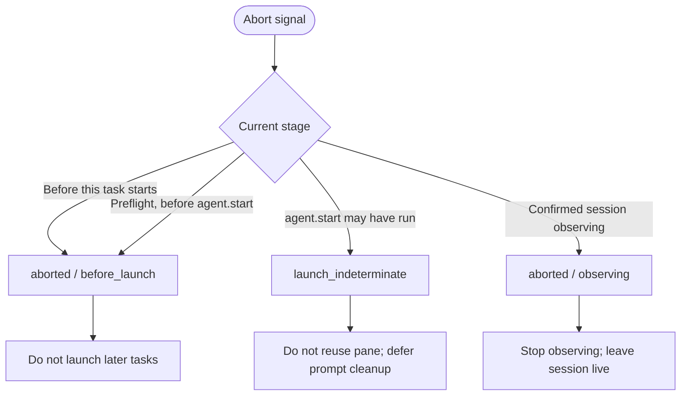

Cancellation controls the parent's work. It does not destroy child sessions.

## Final tool result

Structured details use one shape for one or many requested tasks:

```ts
interface SubagentToolDetails {
  tasks: Array<{
    taskNumber: number;
    agent: string;
    status: DelegatedTaskOutcome["status"];
    session?: SessionRef;
    answer?: SessionAnswerRef;
    stage?: "before_launch" | "observing";
    reason?: string;
    error?: string;
    possiblePaneId?: string;
  }>;
}
```

There is no `mode`, `success`, `invocationId`, display-target duplication, or answer-text duplication.

### Single task

One requested task returns its direct answer or exact status-specific explanation.

```text
<answer text>
```

### Multiple tasks

```markdown
Delegation: 2/4 tasks completed

### Task 1 — code-reviewer — completed

<answer>

---

### Task 2 — missing-agent — invalid

Unknown agent "missing-agent". Available agents: ...

---

### Task 3 — researcher — timed out

The delegated turn timed out after 20 minutes. The visible session remains available in pane ...

---

### Task 4 — reviewer — launch indeterminate

Herdr may have launched this session. Inspect the possible pane before retrying.
```

Task number is canonical. Agent name is descriptive. Exact outcome vocabulary is preserved rather than flattening every non-completed state to “failed.”

Completed answers use Pi's canonical 50 KiB/2,000-line head truncation. The full answer remains in the referenced child session entry.

## Invariants

1. A requested task receives one one-based `taskNumber` exactly once.
2. No second task identity or invocation correlation ID is generated.
3. Structurally valid task entries produce exactly one final positional outcome, including invalid entries.
4. Valid sibling tasks execute even when another task is invalid.
5. Herdr setup may throw only before any child launch begins.
6. Once launch processing begins, known operational conditions become task outcomes.
7. Launches occur sequentially in original valid-task order.
8. Observation begins immediately after each confirmed launch and may complete out of order.
9. Final outcomes and presentation return to original requested-task order.
10. A delegated turn ending never implies that its visible subagent session ended.
11. Timeout and cancellation never close a confirmed child session.
12. Indeterminate launches never reuse the possibly occupied pane.
13. Prompt resources remain until consumption is known or the conservative fallback expires.
14. Final answer extraction uses the exact persisted message entry observed at settlement.
15. Agent discovery and the tool description use the same session-scoped catalog snapshot.

## Test seams

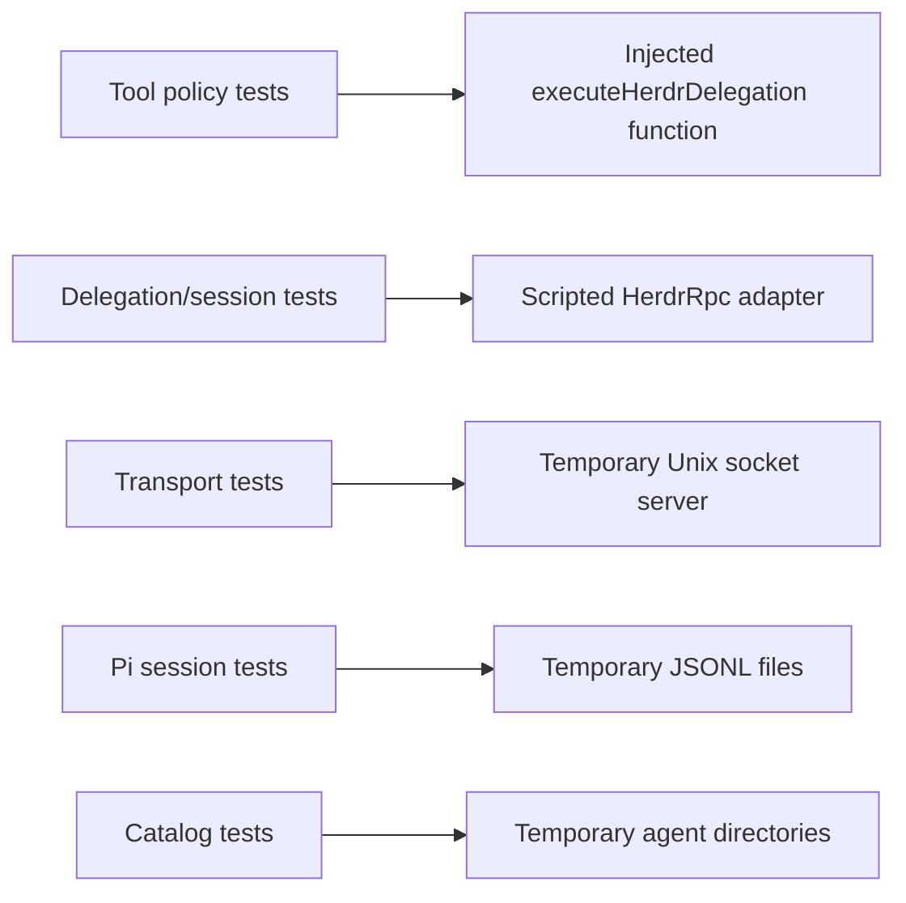

- Tool tests verify strict request policy, mixed valid/invalid tasks, numbering, merging, normalized details, presentation, and truncation.
- Delegation/session tests verify placement, sequential launch, immediate observation, launch certainty, cancellation, timeout, prompt leases, and ordered outcomes.
- RPC tests verify NDJSON framing, response matching, timeout, abort, and response errors.
- Pi session tests verify header capture, exact terminal entry references, later-turn exclusion, malformed lines, and missing answers.
- Catalog tests verify trust, nearest project discovery, precedence, and session snapshot consistency.

Tests cross the same deep interfaces used by production. They do not call private methods or cast constructors through `any`.

## Future extraction

A future non-Herdr runtime is deliberately not represented today. The potential extraction seam is the single call from `subagent-tool.ts` to `executeHerdrDelegation()`.

If a second concrete runtime is built, compare the two implementations and extract only their proven shared task/outcome contract. The Herdr-specific `session.ts` and `rpc.ts` remain behind that future seam.
