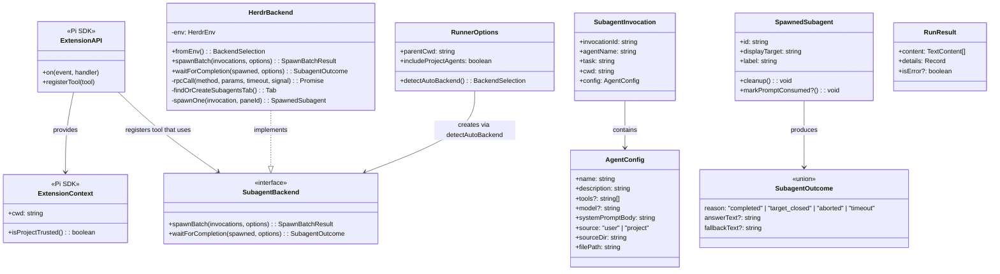
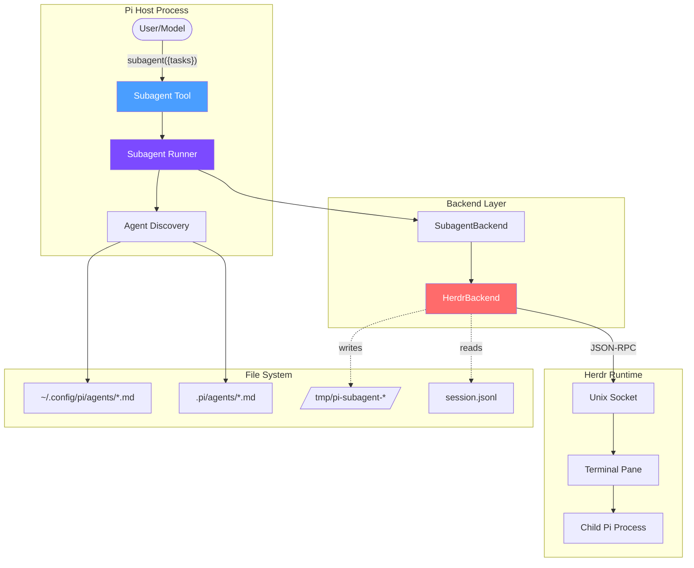
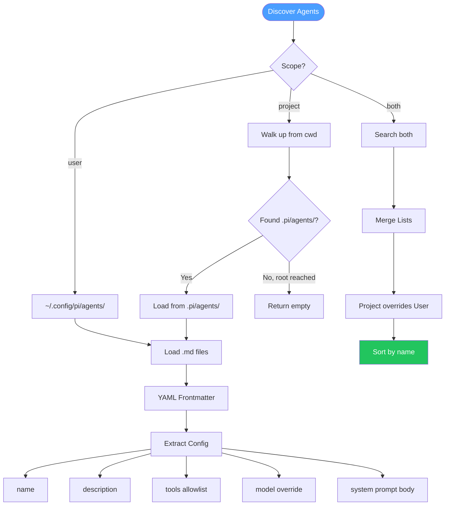
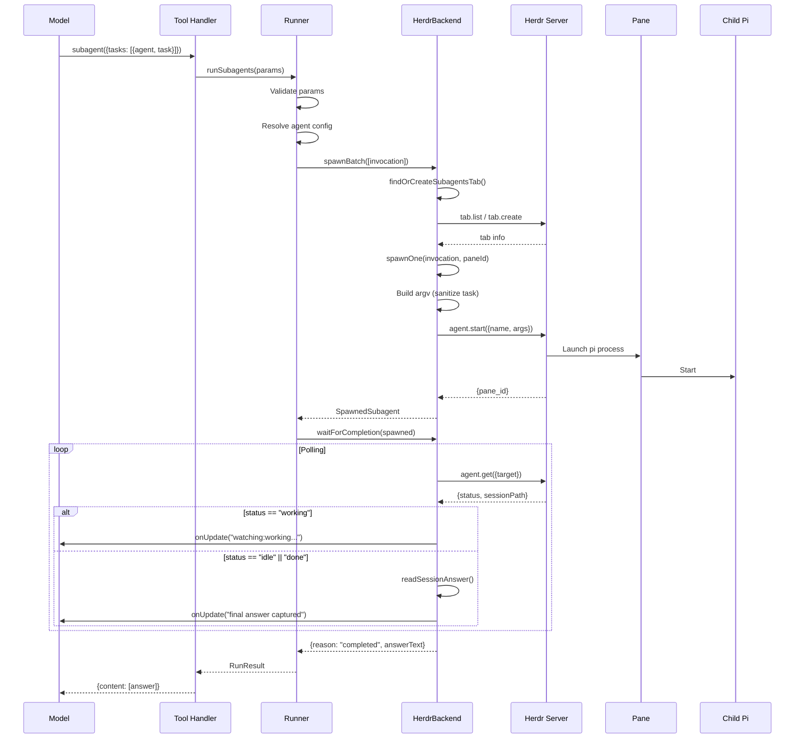
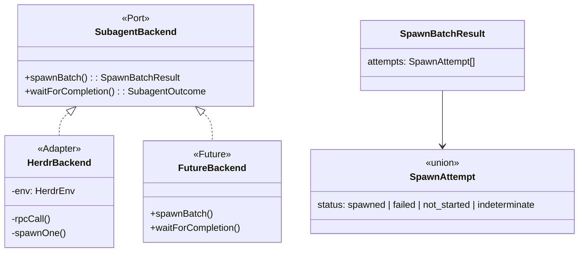
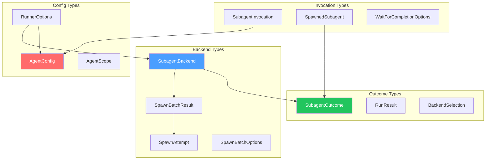

Here's a comprehensive explanation of the sub-agents module with UML diagrams:

---

# Sub-Agents Module Architecture

## Overview

The sub-agents module enables Pi to delegate work to visible, interactive child agents that run in separate terminal panes. It follows a clean port-and-adapter architecture: the runner owns orchestration logic, while backends (like Herdr) handle runtime-specific spawning.

---

## Package Structure

```
packages/
├── herdr-contract/      # Shared event types (blocked state)
├── herdr-subagent/      # Main sub-agent extension
│   ├── index.ts         # Extension entrypoint
│   ├── agents.ts        # Agent discovery & config parsing
│   ├── subagent-runner.ts  # Backend-neutral orchestration
│   ├── herdr-backend.ts # Herdr-specific implementation
│   └── pi-session.ts    # Session file parsing
└── herdr-bridge/        # Herdr event bridge (separate)
```

---

## Class & Interface Diagram



---

## Component Interaction Diagram



---

## Agent Discovery Flow



---

## Tool Execution Flow (Single Task)



---

## Parallel Execution Flow

```mermaid
flowchart LR
    subgraph "Batch 1 (max 4 concurrent)"
        T1[Task 1] --> Spawn1[Spawn]
        T2[Task 2] --> Spawn2[Spawn]
        T3[Task 3] --> Spawn3[Spawn]
    end
    
    subgraph "Wait"
        Spawn1 & Spawn2 & Spawn3 --> Wait[Promise.all]
    end
    
    subgraph "Batch 2"
        Wait --> T4[Task 4]
        T4 --> Spawn4[Spawn]
    end
    
    style Spawn1 fill:#4a9eff,color:#fff
    style Spawn2 fill:#4a9eff,color:#fff
    style Spawn3 fill:#4a9eff,color:#fff
    style Wait fill:#ff6b6b,color:#fff
```

**Key constraints:**
- `MAX_PARALLEL_TASKS = 8` (total tasks)
- `MAX_CONCURRENCY = 4` (concurrent waits)

---

## Backend Port (Adapter Pattern)



---

## Type Hierarchy



---

## Key Design Decisions

| Decision | Rationale |
|----------|-----------|
| **Port/Adapter pattern** | Allows swapping Herdr for tmux or other backends |
| **Session-scoped tool registration** | Description reflects current project trust & agents |
| **Task sanitization** | Herdr rejects control characters in arguments |
| **Batch spawning with concurrency cap** | Prevents overwhelming the system |
| **Stable settled polls** | Avoids premature completion on transient idle states |
| **Prompt file lifecycle** | Temp files cleaned after child confirms session |

---

Would you like me to dive deeper into any specific aspect, such as the error handling paths, the session polling mechanism, or how agent frontmatter is parsed?
